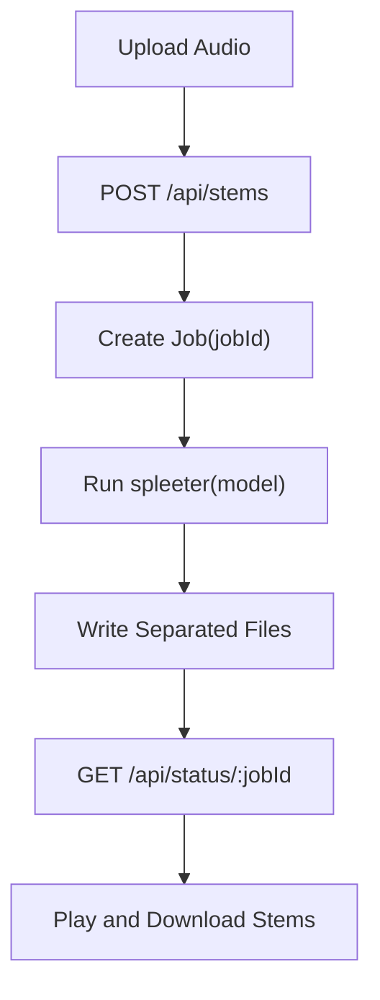

# PrismTrack

这是一个基于 Spleeter 的音乐分轨 Web 应用。用户上传音频后，后端调用 Python 环境中的 Spleeter 将音频分离为人声、鼓组、贝斯、钢琴和其他轨道，前端提供进度展示、在线试听、音量控制和分轨下载。

## 功能

- 上传常见音频文件（`mp3`、`wav`、`m4a`、`ogg`、`flac`）
- 选择 Spleeter 模型（`spleeter:2stems`、`spleeter:4stems`、`spleeter:5stems`）
- 后端异步分轨并提供任务状态查询
- 前端支持单轨播放、全轨播放、静音、音量调节
- 支持下载单个音轨或全部音轨压缩包
- 自动清理过期任务产物（默认 1 小时）
- 模型权重按需下载，支持断点续传与下载失败提示
- Windows 桌面版使用内置 Python/Spleeter/ffmpeg 运行时

## 技术栈

- 后端：Node.js 原生 `http` 服务（`server.js`）
- 前端：原生 HTML/CSS/JavaScript（`index.html`、`styles.css`、`src/main.js`）
- 音频分离：Python 环境中的 Spleeter（通过包装脚本调用）
- 桌面封装：Electron + electron-builder + NSIS

## 快速开始

```bash
# 安装 Node.js 依赖
npm install

# 启动服务
npm start
```

启动后访问：`http://127.0.0.1:8000/`

## 运行依赖

后端依赖可用的 Python + Spleeter 环境。若未安装，可使用：

```bash
# 安装 Spleeter
pip install --break-system-packages spleeter
```

也可以通过环境变量指定 Python 可执行路径：

```bash
# 使用自定义 Python 路径
SPLEETER_PYTHON=/path/to/python npm start
```

## API 概览

- `GET /api/health`：检查 Spleeter 可用性
- `GET /api/ready`：轻量服务就绪检查，供桌面启动等待使用
- `GET /api/models`：获取可选模型列表
- `POST /api/stems`：上传音频并创建分轨任务
- `GET /api/status/:jobId`：查询任务状态与结果
- `GET /api/download/:jobId/:stem`：下载音轨，`:stem` 支持 `vocals`、`drums`、`bass`、`other`、`all`

## 处理流程

1. 前端将音频文件和模型参数通过 `multipart/form-data` 提交到 `/api/stems`。
2. 后端写入临时上传目录，创建任务并异步执行 Spleeter。
3. 前端轮询 `/api/status/:jobId` 获取进度与输出结果。
4. 任务完成后，前端加载分轨音频用于试听和下载。
5. 到达清理时间后，后端自动删除临时输入和分轨输出。



## 目录结构

- `server.js`：API、任务编排、静态文件服务、压缩下载
- `src/main.js`：上传交互、状态轮询、音轨播放器控制
- `index.html`：页面结构
- `styles.css`：页面样式
- `scripts/spleeter_separate.py`：Spleeter Python 包装脚本
- `.runtime/uploads`：上传临时目录（运行时生成）
- `.runtime/prismtrack-stems`：Spleeter 输出目录（运行时生成）
- `.runtime/model-downloads`：模型下载临时归档与 `.part` 续传文件（运行时生成）

## 模型缓存

模型权重不会随安装包内置。后端会在首次使用对应模型时从 Spleeter 官方发布页下载：

- `2stems`
- `4stems`
- `5stems`

桌面版默认缓存目录为 Electron `userData` 下的 `pretrained_models`，例如：

```text
C:\Users\<用户名>\AppData\Roaming\prismtrack-spleeter\pretrained_models
```

下载临时文件位于：

```text
C:\Users\<用户名>\AppData\Roaming\prismtrack-spleeter\.runtime\model-downloads
```

下载过程使用 `.tar.gz.part` 文件支持断点续传。Windows 下如果 Node `fetch` 遇到证书链问题，会回退到系统 `curl.exe` 下载。

## Windows 桌面版

桌面入口位于 `desktop/main.cjs`。桌面层只负责：

- 启动本地 `server.js`
- 等待 `/api/ready`，必要时回退首页 `/`
- 打开本地 Web UI
- 将外部链接交给系统默认浏览器

桌面启动日志写入：

```text
%APPDATA%\prismtrack-spleeter\logs\desktop.log
```

## 备注

- 若 Python/Spleeter 环境不可用，`/api/health` 会返回错误信息。桌面启动不会被深度健康检查阻塞，真实运行时错误会在任务执行或后台日志中体现。
